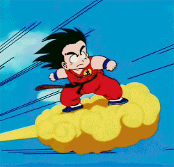
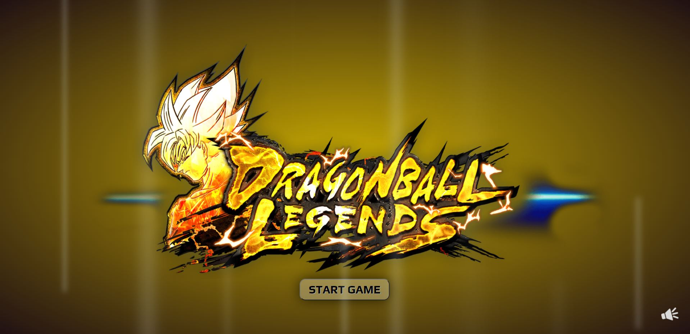
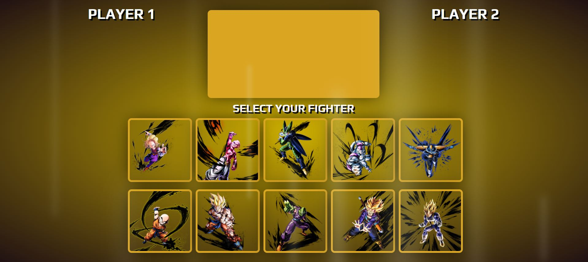
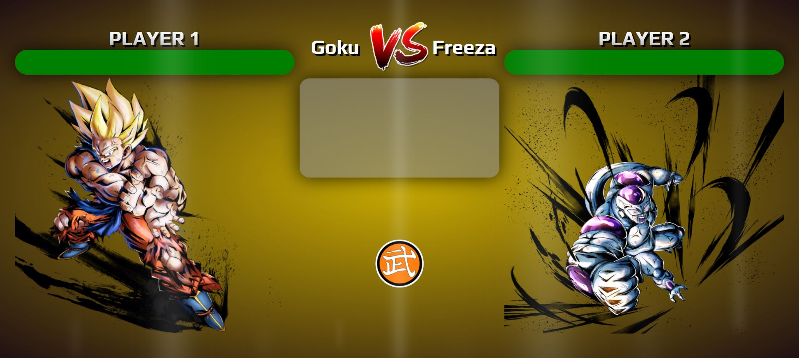
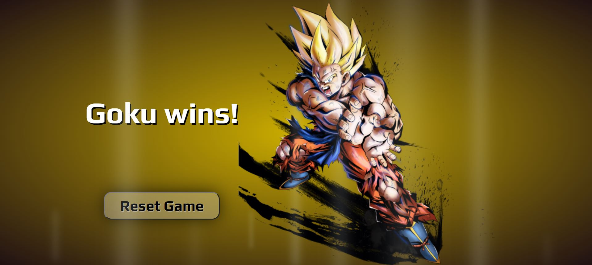

# :fist_right: Dragon Ball Legends :fist_left:

This repository is about emulating one of the best games ever, **Dragon Ball**. The reason why I chose to do a game about it is because I spent my entire childhood watching every morning the episodes of this amazing series right before going to school. Then I would think that I am Son Goku and that I was flying with his magic cloud. 

    

## Introduction

The game is divided in 4 different sections, and the battle is 1 vs 1. Meaning player 1 will choose one figther and player 2 will choose another fighter and even though it is for 2 players, only 1 person will able to clikc the **fight button** in order to start the battle.

## Technology

The different technologies used for this repository are: 
* Html5: 19.6% :white_square_button:
* CSS: 34.2% :diamond_shape_with_a_dot_inside:
* JavaScript: 46.2% :microscope:

#### How to play:sparkles:

In order to be able to play you will need to click on the following link ([Fighting-Game](https://diegogb-08.github.io/Fighting-Game/ "Fighting-Game")) and follow the instructions below: 

1. Once you are in, you will find a first screen with a button start. Press it to continue. You can activate the music pressing the speaker located in the right-bottom part of the screen :speaker: but once you do so, you won't be able to switch the music off. EVER! :rofl:

    

2. On the next phase, you will need to chose 2 fighters. Player 1 will be always red and player 2 will be always blue. Moreover, you will be able to see the stats of all fighters in the golden middle rectangle and once a fighter is selected will appear the image below the PLAYER 1 and PLAYER 2

    

3. Here is where the game begins. In order to start the fight you need to press the button situated in the middle of the screen and the fighters will randomly start fighting, and the battle information will be displayed in the gray square located on top of the button. Moreover, on top of each fighter you will find their health life bar so you can follow up the battle and the damaged caused to each fighter.

    

4. At the end of the battle, the game will show who's the winner and you will be able to Reset the Game in order to play again if you wish to do so by pressing the button **Reset Game**. I bet you will play a second time :wink:

    

# :boom:ENJOY THE BATTLES!:boom: :muscle:

